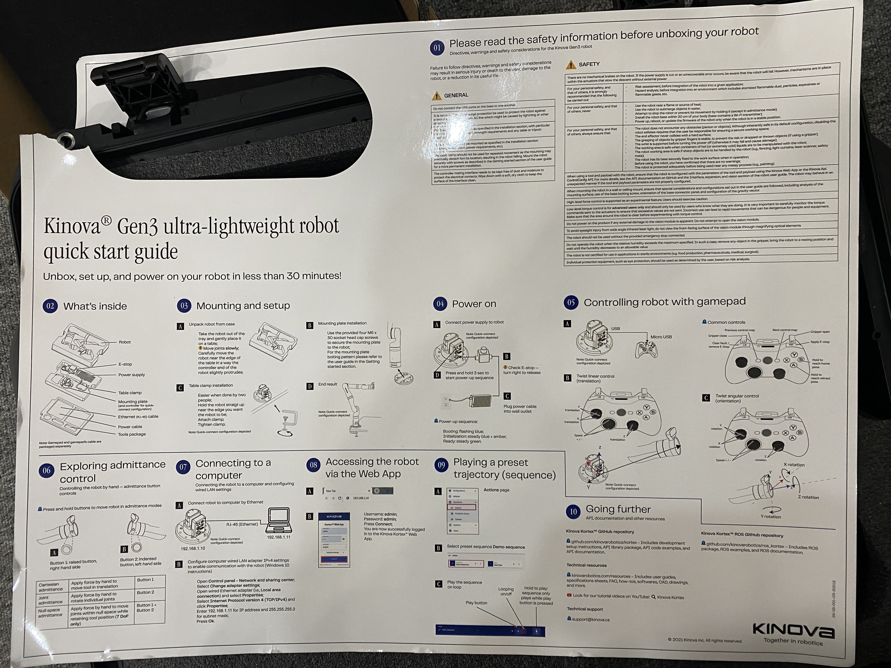

# 	概述

可供参考的文档和视频：

- [Kinova-kortex2_Gen3_G3L](https://github.com/Kinovarobotics/Kinova-kortex2_Gen3_G3L) Kinova 官方的 Github 仓库，其中包含 Python 和 C++ 控制机械臂的示例代码
- [Kortex API](https://docs.kinovarobotics.com/ref/autogen/Messages/index.html) Kortex Python API 文档
- [ros2_kortex](https://github.com/Kinovarobotics/ros2_kortex) Kinova 官方的 Github 仓库，机械臂的 ROS2 环境程序
- [GEN3 ROS2 Training](https://www.youtube.com/watch?v=Vcb_A1MmC-g&list=PLz1XwEYRuku6z20TaZKKvyB2Y6fSzD5FG&ab_channel=Kinova) 使用 ROS2 开发机械臂的 Youtube 教程视频

# 组装机械臂 & 开关机操作

Kinova Gen3 机械臂的组装非常简单，可按照开箱自带的快速使用纸（下图）和相关[视频](https://www.youtube.com/watch?v=2Ncjfb1d-EQ&ab_channel=Kinova)进行组装。

​	安装时注意检查急停按钮是否被按下，急停按钮没有被按下，机械臂才会正确通电。

组装完毕后，长按机械臂后面最大的按钮来启动机械臂。

​	注意，长按不到三秒指示灯就会亮，就可以松开手；如果长按达十秒钟，机械臂就会恢复出厂设置。

机械臂使用完毕后，如要要关闭机械臂，要先令机械臂回到 "retract" 姿态，最后长按机械臂后面的最大的按钮使机械臂关机。

​	回到 "retract" 姿态的操作步骤：先长按手柄上 "B" 键令机械臂达到 "home" 姿态，再长按 "A" 键令机械臂达到 "retract" 姿态。

# 使用手柄控制机械臂

手柄各个按钮的功能如下图所示：

其中标注为 "Next control map" 的按钮（现实中手柄上右侧图案为三条杠的小按钮），可以切换不同的操作模式，一共有三种模式：

- 旋转基座，仅左边遥感的左右拖动有效，分别对应左转和右转
- 移动末端执行器的空间位置
- 调整末端执行器的位姿

分别长按右侧的 "B" "A" 按钮，可以分别令机械臂到达 "home" "retract" 姿态

# 在个人电脑 Web 端控制机械臂

步骤如下：

1. 使用网线将电脑和机械臂连接
2. 在电脑（以 window11 为例）上，打开设置 -> 网络和 Internet -> 以太网连接 -> IPv4，将 IPv4 配置切换为手动，IP 地址填 192.168.1.11，子网掩码填 255.255.255.0，其他信息不填
3. 在浏览器中输入机械臂的 IP 地址 192.168.1.10，出现登陆界面后用户和密码均为 admin

Ubuntu 中一样，就是在有线中设置 IPV4，在 address 中填入 192.168.1.11

参考：

关于配置 Python 环境说明的一篇 CSDN 博客：https://blog.csdn.net/weixin_43935696/article/details/146117307

# 装配 robotiq 夹爪

步骤如下：

1. 将 Kinova Gen3 关机，直接把 robotiq 夹爪安装上。
2. 启动 Kinova Gen3，在电脑 Web 端，打开左侧导航栏 -> Configuration -> Robot -> Arm -> Product -> End Effector Type 选择 Robotiq 2F-85 gripper。图示如下：

