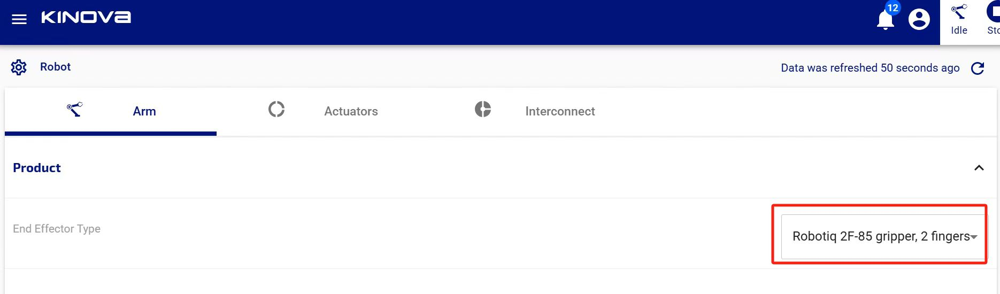
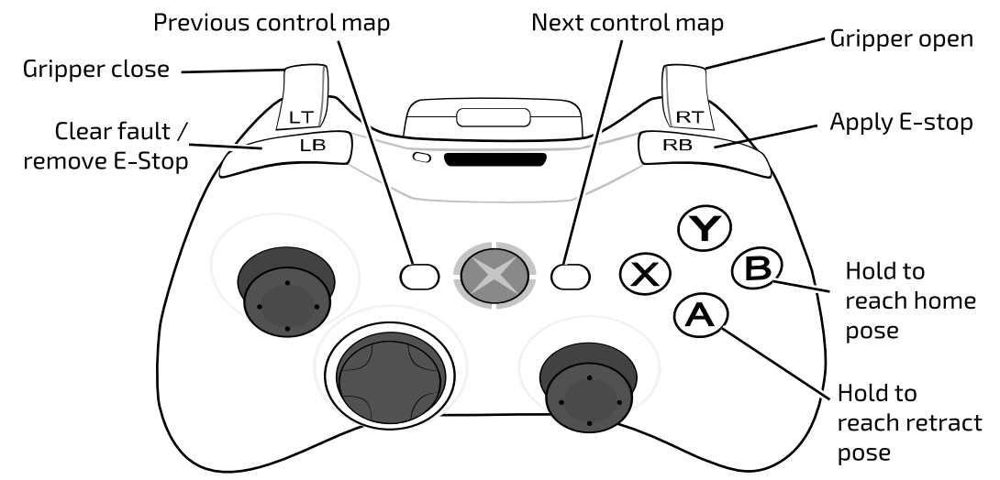

# 概述

可供参考的官方文档和视频：
- [Kinova-kortex2_Gen3_G3L](https://github.com/Kinovarobotics/Kinova-kortex2_Gen3_G3L) 机械臂的底层代码程序，包含 Python 和 C++ 控制机械臂的示例代码 `Github`
- [Kortex API](https://docs.kinovarobotics.com/ref/autogen/Messages/index.html) (Kortex Python API 文档)
- [ros2_kortex](https://github.com/Kinovarobotics/ros2_kortex) (机械臂的 ROS2 环境程序) #Github
- [GEN3 ROS2 Training](https://www.youtube.com/watch?v=Vcb_A1MmC-g&list=PLz1XwEYRuku6z20TaZKKvyB2Y6fSzD5FG&ab_channel=Kinova) (使用 ROS2 开发机械臂的教程视频) #Youtube
- [Kinova-kortex2_Gen3_G3L]: https://github.com/Kinovarobotics/Kinova-kortex2_Gen3_G3L "ceshi"


# 组装机械臂 & 基本使用

Kinova Gen3 机械臂的组装非常简单，可按照开箱自带的快速使用纸（在备注信息中）和相关[视频](https://www.youtube.com/watch?v=2Ncjfb1d-EQ&ab_channel=Kinova)进行组装。

安装时注意检查急停按钮是否打开（没有被按下就行），急停按钮打开，机械臂才会正确通电。

组装完毕后，长按机械臂后面按钮启动机械臂。（注意，长按不到三秒指示灯就会亮，就可以松开手；如果长按长达十秒钟，机械臂就会恢复出厂设置）

机械臂使用完毕后，如要要关闭机械臂，要先长按手柄上 "B" 键令机械臂达到 "home" 姿态，再长按 "A" 键令机械臂达到 "retract" 姿态，最后长按机械臂后面的按钮使机械臂关机。


参考：

Kinova Gen3 - Unpack & Install (Youtube) (官方安装 Kinova Gen3 的视频): https://www.youtube.com/watch?v=2Ncjfb1d-EQ&ab_channel=Kinova


# 连接电脑 在 Web 端控制机械臂

步骤如下：

1. 使用网线将电脑和机械臂连接
2. 在电脑（以 window11 为例）上，打开设置 -> 网络和 Internet -> 以太网连接 -> IPv4，将 IPv4 配置切换为手动，IP 地址填 192.168.1.11，子网掩码填 255.255.255.0，其他信息不填
3. 在浏览器中输入机械臂的 IP 地址 192.168.1.10，出现登陆界面后用户和密码均为 admin


参考：

关于配置 Python 环境说明的一篇 CSDN 博客：https://blog.csdn.net/weixin_43935696/article/details/146117307

http://www.robotdhzt.com/intro/9.html


Ubuntu 中一样，就是在有线中设置 IPV4，在 address 中填入 192.168.1.11


# 装配 robotiq 夹爪

步骤如下：

1. 将 Kinova Gen3 关机，直接把 robotiq 夹爪安装上。

2. 启动 Kinova Gen3，在电脑 Web 端，打开左侧导航栏 -> Configuration -> Robot -> Arm -> Product -> End Effector Type 选择 Robotiq 2F-85 gripper。图示如下：

   


# 使用手柄控制机械臂和夹爪

手柄各个按钮的功能如下图所示：



其中标注为 "Next control map" 的按钮（现实中手柄上右侧图案为三条杠的小按钮），可以切换不同的操作模式，一共有三种模式：

- 旋转基座，仅左边遥感的左右拖动有效，分别对应左转和右转
- 移动末端执行器的空间位置
- 调整末端执行器的位姿

分别长按右侧的 "B" "A" 按钮，可以分别令机械臂到达 "home" "retract" 姿态


# 使用 Python 代码控制机械臂

## 连接机械臂的基础环境代码

按照官方示例文件中的做法。

将 文件 utilities.py (在 examples 文件夹下) 放在被导入的位置 (放在一个可以被公共调用的位置，以方便被多个文件调用)，以 examples 文件夹中的位置为例。

编写 Python 代码文件时，导入该文件，编写连接机械臂的基础代码环境：

```python
import sys
import os
from kortex_api.autogen.client_stubs.BaseClientRpc import BaseClient
from kortex_api.autogen.client_stubs.BaseCyclicClientRpc import BaseCyclicClient

# 这里编写控制控制机械臂的函数
# def move_to_home_position(base):
# def cartesian_action_movement(base, base_cyclic):
# ...

# 或者调用第三方文件
# from move_to_home_position import move_to_home_position
# from cartesian_action_movement import cartesian_action_movement
# ...

def main():
  sys.path.insert(0, os.path.join(os.path.dirname(__file__), ".."))
  import utilities
  args = utilities.parseConnectionArguments()  
  with utilities.DeviceConnection.createTcpConnection(args) as router:
    base = BaseClient(router)
    base_cyclic = BaseCyclicClient(router)
    
    # 这里依次调用控制机械臂的函数
    # move_to_home_position(base)  
    # cartesian_action_movement(base, base_cyclic)
    # ...

if __name__ == "__main__":
  main()
```


参考：

[Github 项目 Kinova-kortex2_Gen3_G3L]: https://github.com/Kinovarobotics/Kinova-kortex2_Gen3_G3L/blob/master/api_python/examples/102-Movement_high_level/03-twist_command.py "api_python -> examples -> 102-Movement_high_level -> 03-twist_command.py"

(该 Github 项目在 files 文件下有备份)


## 控制机械臂回到 home 姿态

代码如下：

```python
from kortex_api.autogen.messages import Base_pb2
import threading


def check_for_end_or_abort(e):
    """Return a closure checking for END or ABORT notifications
    Arguments:
    e -- event to signal when the action is completed
        (will be set when an END or ABORT occurs)
    """
    def check(notification, e = e):
        print("EVENT : " + \
              Base_pb2.ActionEvent.Name(notification.action_event))
        if notification.action_event == Base_pb2.ACTION_END \
        or notification.action_event == Base_pb2.ACTION_ABORT:
            e.set()
    return check

  
def move_to_home_position(base):
    # Make sure the arm is in Single Level Servoing mode
    base_servo_mode = Base_pb2.ServoingModeInformation()
    base_servo_mode.servoing_mode = Base_pb2.SINGLE_LEVEL_SERVOING
    base.SetServoingMode(base_servo_mode)
    
    # Move arm to ready position
    print("Moving the arm to a safe position")
    action_type = Base_pb2.RequestedActionType()
    action_type.action_type = Base_pb2.REACH_JOINT_ANGLES
    action_list = base.ReadAllActions(action_type)
    action_handle = None
    for action in action_list.action_list:
        if action.name == "Home":
            action_handle = action.handle

    if action_handle == None:
        print("Can't reach safe position. Exiting")
        sys.exit(1)

    e = threading.Event()
    notification_handle = base.OnNotificationActionTopic(
        check_for_end_or_abort(e),
        Base_pb2.NotificationOptions()
    )
    
    base.ExecuteActionFromReference(action_handle)
    
    # Leave time to action to complete
    e.wait()
    base.Unsubscribe(notification_handle)
```


参考：

[Github 项目 Kinova-kortex2_Gen3_G3L]: https://github.com/Kinovarobotics/Kinova-kortex2_Gen3_G3L/blob/master/api_python/examples/102-Movement_high_level "api_python -> examples -> 102-Movement_high_level"

(该 Github 项目代码在 files 文件下有备份)


## 控制末端执行器到达指定位姿

代码如下：

```python
from kortex_api.autogen.messages import Base_pb2
import threading

def check_for_end_or_abort(e):
    """Return a closure checking for END or ABORT notifications
    Arguments:
    e -- event to signal when the action is completed
        (will be set when an END or ABORT occurs)
    """
    def check(notification, e = e):
        print("EVENT : " + \
              Base_pb2.ActionEvent.Name(notification.action_event))
        if notification.action_event == Base_pb2.ACTION_END \
        or notification.action_event == Base_pb2.ACTION_ABORT:
            e.set()
    return check

def example_cartesian_action_movement(base, base_cyclic, x, y, z, theta_x, theta_y, theta_z):    
    print("Starting Cartesian action movement ...")
    action = Base_pb2.Action()
    action.name = "Example Cartesian action movement"
    action.application_data = ""

    feedback = base_cyclic.RefreshFeedback()

    cartesian_pose = action.reach_pose.target_pose
    cartesian_pose.x = feedback.base.tool_pose_x          # (meters)  # 这里 feedback.base.tool_pose_x 是当前位姿 x，也可以直接赋予指定参数
    cartesian_pose.y = feedback.base.tool_pose_y - 0.1    # (meters)
    cartesian_pose.z = feedback.base.tool_pose_z - 0.2    # (meters)
    cartesian_pose.theta_x = feedback.base.tool_pose_theta_x # (degrees)
    cartesian_pose.theta_y = feedback.base.tool_pose_theta_y # (degrees)
    cartesian_pose.theta_z = feedback.base.tool_pose_theta_z # (degrees)

    e = threading.Event()
    notification_handle = base.OnNotificationActionTopic(
        check_for_end_or_abort(e),
        Base_pb2.NotificationOptions()
    )

    print("Executing action")
    base.ExecuteAction(action)

    print("Waiting for movement to finish ...")
    finished = e.wait(TIMEOUT_DURATION)
    base.Unsubscribe(notification_handle)

    if finished:
        print("Cartesian movement completed")
    else:
        print("Timeout on action notification wait")
    return finished
```


坐标系：以机械臂home姿态为参考，夹爪的朝向为 x 轴，从 x 轴看过去，朝左为 y 轴，朝上为 z 轴。

姿态：z 是沿 xy 轴平面旋转，x 是沿 xz 轴平面旋转，y 是沿 yz 轴平面旋转。单独修改一个，它会保持在该平面上，并在该平面上旋转。


直接赋值的话 x -180 是完全垂直朝下的，-150 朝里，-210 朝外（要给负值，正值多次执行不了），-270 就是垂直向前，甚至 -280 也能赋值

如果用 base.tool_pose 减的话，x + 30 就是上抬30度

y + 30 是从后面看过去逆时针旋转 30 度 （y 是旋转夹爪，home姿态的夹爪位置0; 90是垂直的）

z + 30 是从后面看过去向右旋转 30 度 （z 120 是向下旋转）


y 30 向后面看过去是 向左转30度，-30 则是向右转30度；0 就是最中的位置

z 是旋转夹爪，90是初始最中的位置，45 就是（从上向下看）顺时针45度


z 垂直向下时是旋转夹爪，向前时是左右转

（需要再核实一下）


参考：

[Github 项目 Kinova-kortex2_Gen3_G3L]: https://github.com/Kinovarobotics/Kinova-kortex2_Gen3_G3L/blob/master/api_python/examples/102-Movement_high_level/01-move_angular_and_cartesian.py "api_python -> examples -> 102-Movement_high_level -> 01-move_angular_and_cartesian.py"

(该 Github 项目在 files 文件下有备份)


## 控制夹爪张开和闭合

控制夹爪张开的代码：

```python
from kortex_api.autogen.messages import Base_pb2
import time

def control_gripper(base, mode):
  gripper_command = Base_pb2.GripperCommand()
  finger = gripper_command.gripper.finger.add()
  finger.finger_identifier = 1
  gripper_command.mode = Base_ph2.GRIPPER_SPEED
  finger.value = 0.1 if mode == "close" else -0.1
  base.SendGripperCommand(gripper_command)
  gripper_request = Base2_pb2.GripperRequest()
  
  if mode != "close":
    gripper_request.mode = Base_pb2.GRIPPER_POSITION
    while True:
      gipper_measure = base.GetMeasuredGripperMovement(gripper_request)
      if len (gripper_measure.finger):
        if gripper_measure.finger[0].value < 0.01:
          break
      else:
        break
  else:
		gripper_request.mode = Base_pb2.GRIPPER_SPEED
    while True:
      gripper_measure = self.base.GetMeasuredGripperMovement(gripper_request)
      if len (gripper_measure.finger):
        if gripper_measure.finger[0].value == 0.0:
          break
      else:
        break
    time.sleep(5)
```


# Python playground 记录


## 控制机械臂末端执行器到达执行位姿

```python
from kortex_api.autogen.messages import Base_pb2
import threading

TIMEOUT_DURATION = 20

def check_for_end_or_abort(e):
    def check(notification, e = e):
        print("EVENT : " + \
              Base_pb2.ActionEvent.Name(notification.action_event))
        if notification.action_event == Base_pb2.ACTION_END \
        or notification.action_event == Base_pb2.ACTION_ABORT:
            e.set()
    return check


def moveToCartesian(base, x, y, z, theta_x, theta_y, theta_z):
    action = Base_pb2.Action()
    action.name = "Example Cartesian action movement"
    action.application_data = ""

    cartesian_pose = action.reach_pose.target_pose
    cartesian_pose.x = x
    cartesian_pose.y = y
    cartesian_pose.z = z
    cartesian_pose.theta_x = theta_x
    cartesian_pose.theta_y = theta_y
    cartesian_pose.theta_z = theta_z

    e = threading.Event()
    notification_handle = base.OnNotificationActionTopic(
        check_for_end_or_abort(e),
        Base_pb2.NotificationOptions()
    )
    
    base.ExecuteAction(action)

    finished = e.wait(TIMEOUT_DURATION)
    base.Unsubscribe(notification_handle)

    if finished: print("Cartesian movement completed")
    else: print("Timeout on action notification wait")
    return finished


def moveToHome(base):
    # Make sure the arm is in Single Level Servoing mode
    base_servo_mode = Base_pb2.ServoingModeInformation()
    base_servo_mode.servoing_mode = Base_pb2.SINGLE_LEVEL_SERVOING
    base.SetServoingMode(base_servo_mode)
    
    # Move arm to ready position
    print("Moving the arm to a safe position")
    action_type = Base_pb2.RequestedActionType()
    action_type.action_type = Base_pb2.REACH_JOINT_ANGLES
    action_list = base.ReadAllActions(action_type)
    action_handle = None
    for action in action_list.action_list:
        if action.name == "Home":
            action_handle = action.handle

    if action_handle == None:
        print("Can't reach safe position. Exiting")
        return False

    e = threading.Event()
    notification_handle = base.OnNotificationActionTopic(
        check_for_end_or_abort(e),
        Base_pb2.NotificationOptions()
    )

    base.ExecuteActionFromReference(action_handle)
    finished = e.wait(TIMEOUT_DURATION)
    base.Unsubscribe(notification_handle)

    if finished:
        print("Safe position reached")
    else:
        print("Timeout on action notification wait")
    return finished


def moveToCustomize1(base, base_cyclic):
    moveToCartesian(base, base_cyclic, 0.647, -0.015, -0.053, 179.189, -0.204, 90)
```


# 备注信息

开箱时的 quick start guide 纸：


# 记录


ROS2 项目中，要想在 ubuntu22 hubmble 中实现方针，要使用 humble_Gazebo_Classic_Support 的分支才可以成功


